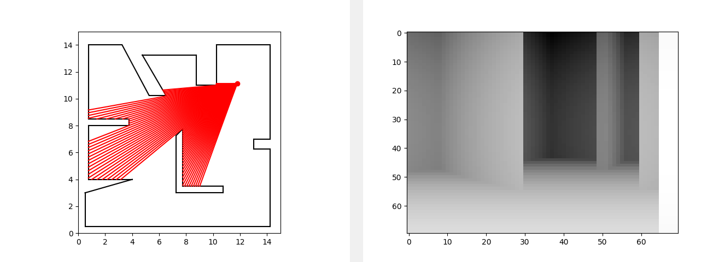

# 3D Engine

This project is a simple 3D engine that simulates a player's movement in a 3D world. The engine uses Python and PyQt5 for the graphical interface and Matplotlib for rendering the 2D and 3D views.

## Features

- 2D and 3D views of the world
- Player movement and rotation
- Ray casting to detect walls and floor
- Adjustable field of view and sample rate

## Usage

1. Run the main script:
    ```sh
    python main.py
    ```

2. Use the following keys to control the player:
    - `W`: Move forward
    - `S`: Move backward
    - `A`: Turn left
    - `D`: Turn right

## Example



## File Structure

- `main.py`: Entry point of the application
- `player.py`: Defines the Player class
- `viewer2d.py`: Defines the 2D viewer
- `viewer3d.py`: Defines the 3D viewer
- `main_window.py`: Defines the main window
- `world.json`: Contains the world data